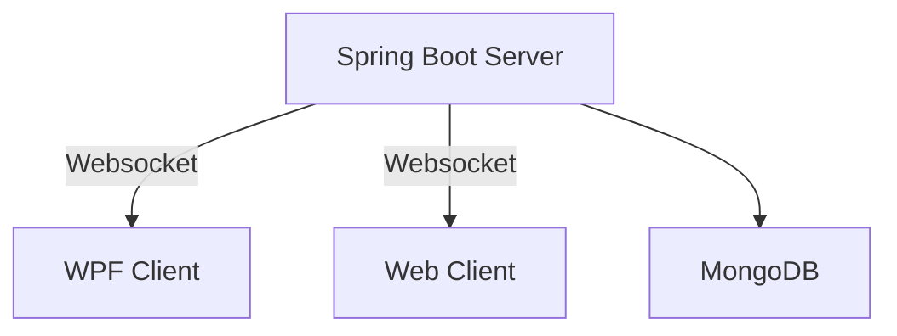
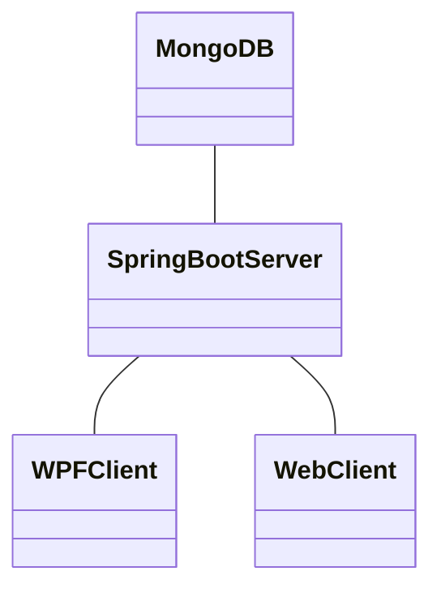
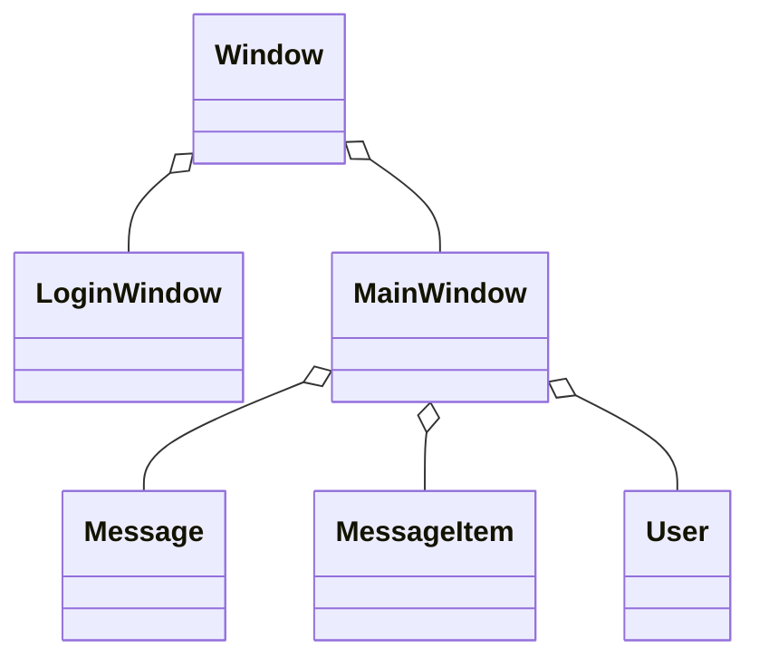
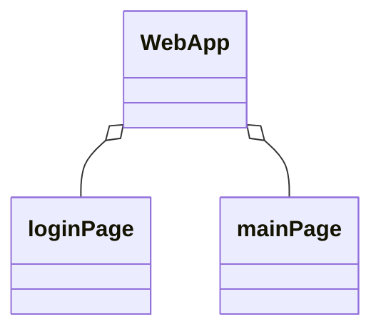
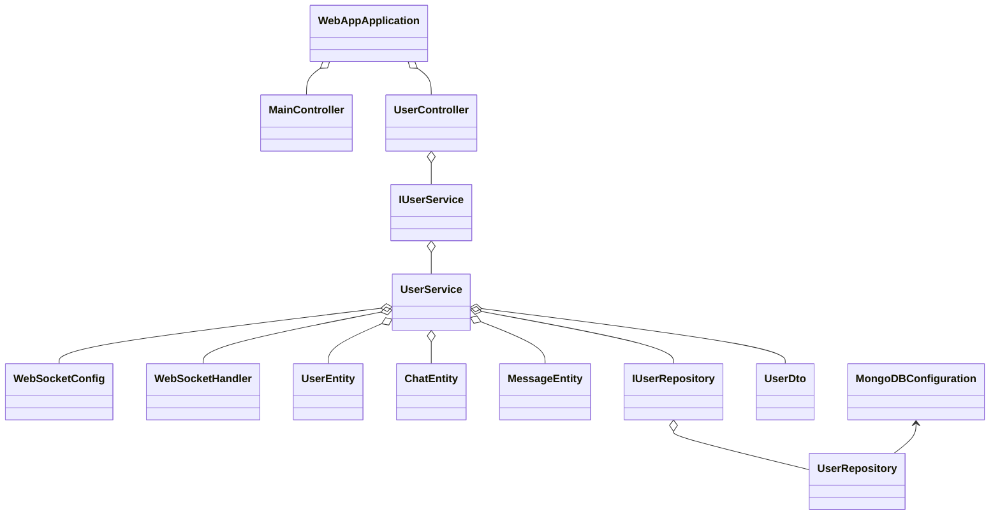

# 4AHINF - POS - Semesterprojekt - Chatapp (TinyWhatsApp) - Krallinger

## Softwarearchitektur

Die Chatapp, Tiny Whatsapp, besteht aus einer Client-Client-Server-Architektur. Es wurde ein Client als WPF-Anwendung und ein Client als WebApp implementiert. Diese kommunizieren mit dem Spring Boot Server und werden von einem Websocket über neue Nachrichten informiert. Die Benutzerdaten und Chats werden in einer MongoDB Datenbank gespeichert.


<br>

## Beschreibung der Software

Die Chatapp bietet die Möglichkeit, dass Benutzer, über eine einfache Benutzeroberfläche, miteinander kommunizieren können. Der Benutzer kann entscheiden ob er die App im Web oder als WPF-Anwendung verwendet. Es ist möglich meherer Chats mit verschiedenen Benutzern zu haben und mit allen zu kommunizieren. Alle Chatverläufe werden in einer MongoDB-Datenbank gesichert und können immer wieder geladen werden.

<br>

## Web-App - Funktionen

### Login - Web
<br>
<br>
Im Eingabefeld **"Username"** wird der Benutzernamen eingegeben. (Testuser Benutzernamen --> **testUser** / **testUser2** / **testUser3**)<br>
Im Eingabefeld **"Passwort"** wird das Passwort des Benutzers eingegeben. (Testuser Passwörter --> **test** / **test1** / **test3**)<br>
Beim klick auf den **"Login"** Button werden die Anmeldedaten überprüft und bei erfolgreicher Überprüfung wird der Benutzer auf die Hauptseite weitergeleitet.<br>
Bei ungültigen oder unvollständigen Benutzerdaten wird der Benutzer darauf hingewiesen, dass seine Daten nicht korrekt sind und es kann ein neuer Versuch gestartet werden.<br>
<br>
<br>
<br>
<br>
<br>
Wenn der eingegeben Benutzername noch nicht vorhanden ist wird ein neuer Benutzer erstellt und danach die Hauptseite geladen.

### Mainpage - Web
<br>
<br>

#### Chats - Web
Im linken, schwarzem Feld werden alle Chats eines Benutzers angezeigt.<br>
Bei klick auf einen Chat werden rechts die Nachrichten des Chats angezeigt.<br>
Bei klick auf den **"Chat hinzufügen"** Button kann der Benutzer einen neuen Chat erstellen.<br>
Der Benutzer gibt zuerst den Benutzername des Empfängers und dann den Namen des Chats ein, sobald diese Eingabe erfolgt ist wird der Chat erstellt und im Chatfeld angezeigt.<br>
<br>
<br>
<br>
<br>


#### Nachrichten - Web
<br>
Im rechten Feld werden alle Nachrichten eines Chats angezeigt und in Echtzeit aktualisiert.<br>
Bei klick auf den Button rechts unten oder durch drücken von **"ENTER"** kann der Benutzer einen neue Nachricht senden.<br>
Der Benutzer gibt die Nachricht in das Textfeld ein, sobald die Eingabe erfolgt ist wird die Nachricht zum Empfänger gesendet.<br>
Bei beiden wird die GUI aktualisiert und die neue Nachricht wird im Nachrichtenfeld angezeigt.<br>
Bei einer neuen Nachricht wird dem Benutzer angezeigt in welchem Chat eine neue Nachricht eingegangen ist.<br> 
<br>
<br>

### WPF-App - Funktionen

### Login - WPF
<br>
<br>
Im Eingabefeld **"Benutzername"** wird der Benutzernamen eingegeben. (Testuser Benutzernamen --> **testUser** / **testUser2** / **testUser3**)<br>
Im Eingabefeld **"Passwort"** wird das Passwort des Benutzers eingegeben. (Testuser Passwörter --> **test** / **test1** / **test3**)<br>
Beim klick auf den **"Login"** Button werden die Anmeldedaten überprüft und bei erfolgreicher Überprüfung wird der Benutzer auf das Hauptfenster weitergeleitet.<br>
Bei ungültigen oder unvollständigen Benutzerdaten wird der Benutzer darauf hingewiesen, dass seine Daten nicht korrekt sind und es kann ein neuer Versuch gestartet werden.<br>
<br>
<br>
<br>
<br>
<br>
Wenn der eingegeben Benutzername noch nicht vorhanden ist wird ein neuer Benutzer erstellt.

### Hauptfenster - WPF
<br>
<br>

#### Chats - WPF
Im linken, schwarzem Feld werden alle Chats eines Benutzers angezeigt.<br>
Bei klick auf einen Chat werden rechts die Nachrichten des Chats angezeigt.<br>
Bei klick auf den **"Chat hinzufügen"** Button kann der Benutzer einen neuen Chat erstellen.<br>
Der Benutzer gibt zuerst den Benutzername des Empfängers in das Textfeld **"Empfänger"** und dann den Namen des Chats in das Textfeld **"Chatname"** ein, sobald diese Eingabe erfolgt ist wird der Chat erstellt und im Chatfeld angezeigt.<br>
<br>
<br>
<br>

#### Nachrichten - WPF
<br>
Im rechten Feld werden alle Nachrichten eines Chats angezeigt und in Echtzeit aktualisiert.<br>
Bei klick auf den Button rechts unten oder durch drücken von **"ENTER"** kann der Benutzer einen neue Nachricht senden.<br>
Der Benutzer gibt die Nachricht in das Textfeld ein, sobald die Eingabe erfolgt ist wird die Nachricht zum Empfänger gesendet.<br>
Bei beiden wird die GUI aktualisiert und die neue Nachricht wird im Nachrichtenfeld angezeigt.<br>
Bei einer neuen Nachricht wird dem Benutzer angezeigt in welchem Chat eine neue Nachricht eingegangen ist.<br> 
<br>
<br>

<br>

## API-Beschreibung
Die API wird durch einen Spring Boot Server basierend auf dem REST-Prinzip implementiert. Spring Boot ermöglicht es Clients mit dem Server, über GET und POST, zu kommunizieren und Daten auszutauschen. Weiters bietet der Server einen Websocket, bei dem sich alle Benutzer nach der Anmeldung registrieren, damit sie bei neuen Nachrichten benachrichtigt werden können und die GUI aktualisiert werden kann.<br>

### Endpunkte:<br>

<!-- Hauptendpunkt -->
<details>
  <summary>/app </summary>
  
  **Beschreibung:** Dieser Endpunkt ist der Hauptendpunkt der API, er muss vor jedem anderen Endpoint geschrieben werden.
</details>

<!-- MainController -->
<details>
  <summary>/Login [GET]</summary>
  
  **Beschreibung:** Dieser Endpunkt gibt die Html Seite **"loginPage.htmnl"** zurück.
</details>
<details>
  <summary>/mainPage [GET]</summary>
  
  **Beschreibung:** Dieser Endpunkt gibt die Html Seite **"mainPage.htmnl"** zurück.
</details>

<!-- UserController -->
<!-- Login -->
<details>
  <summary>/user [POST]</summary>
  
  **Beschreibung:** Dieser Endpunkt prüft die eingegebenen Benutzerdaten und authorisiert den Login. 
                    Es wird ein neuer Benutzer erstellt oder der vorhandene Benutzer verwendet.
  
  **JSON-Body:**
  ```json
  {
    "username": "Benutzername",
    "password": "Passwort"
  }
  ```

  **Return-Wert:**
  ```json
  {
    "id": "ID",
    "username": "Benutzername",
    "password": "Passwort",
    "chats": [
      {
        "bezeichnung": "Chatname",
        "receiver": "EmpfaengerID",
        "messageEntities": [
          {
            "message": "Nachricht",
            "receiver": "True || False",
            "date": "Zeitstempel"
          },
          { ... }
        ]
      },
      { ... }
    ]
  }
  ```
</details>

<!-- Benutzerverwaltung -->
<details>
  <summary>/users [GET]</summary>
  
  **Beschreibung:** Dieser Endpunkt gibt eine Liste aller registrierten Benutzer zurück.

  **Return-Wert:**
  ```json
  [
    {
      "id": "ID",
      "username": "Benutzername",
      "password": "Passwort",
      "chats": [
        {
          "bezeichnung": "Chatname",
          "receiver": "EmpfaengerID",
          "messageEntities": [
            {
              "message": "Nachricht",
              "receiver": "True || False",
              "date": "Zeitstempel"
            },
            { ... }
          ]
        },
        { ... }
      ]
    },
  ...
],
...
  ```
</details>

<!-- Chatverwaltung -->
<details>
  <summary>/users/{userId}/chats [GET]</summary>
  
  **Beschreibung:** Dieser Endpunkt gibt eine Liste aller Chats des aktuellen Benutzers zurück.

  **JSON-Body:**
    ```json
    {
      "userId": "UserID",
    }
    ```

  **Return-Wert:**
  ```json
  [
    {
      "bezeichnung": "Chatname",
      "receiver": "EmpfaengerID",
      "messageEntities": [
        {
          "message": "Nachricht",
          "receiver": "True || False",
          "date": "Zeitstempel"
        },
        { ... }
      ]
    },
    { ... }
]
...
  ```
</details>
<details>
  <summary>/users/{userId}/chat/{chatId} [GET]</summary>
  
  **Beschreibung:** Dieser Endpunkt gibt einen Chat des Benutzers zurück.
  
  **JSON-Body:**
  ```json
  {
    "userId": "UserID",
    "chatId": "ChatID"
  }
  ```

  **Return-Wert:**
  ```json
 {
    "bezeichnung": "Chatname",
    "receiver": "EmpfaengerID",
    "messageEntities": [
      {
        "message": "Nachricht",
        "receiver": "True || False",
        "date": "Zeitstempel"
      },
      { ... }
    ]
 }
  ```
</details>
<details>
  <summary>/addChat [POST]</summary>
  
  **Beschreibung:** Dieser Endpunkt erstellt einen neuen Chat.
  
  **JSON-Body:**
  ```json
  {
    "userId": "UserID",
    "chatName": "Chatname",
    "receiver": "EmpfaengerID"
  }
  ```
</details>

<!-- Nachrichtenverwaltung -->
<details>
  <summary>/addMsg [POST]</summary>
  
  **Beschreibung:** Dieser Endpunkt erstellt eine neue Nachricht und sendet sie zum Empfänger.
  
  **JSON-Body:**
  ```json
  {
    "id": "UserID",
    "chatname": "Chatname",
    "msg": "Nachricht",
    "receiver": "EmpfaengerID"
  }
  ```
</details>

<!-- Chatstatus -->
<details>
  <summary>/updateStatus [POST]</summary>
  
  **Beschreibung:** Dieser Endpunkt setz den Status eines Chats auf gelesen.
  
  **JSON-Body:**
  ```json
  {
    "id": "UserID",
    "chatname": "Chatname"
  }
  ```
</details>

<br>

## Verwendung der API

Abbildung der Topologie, der MongoDB-Konfiguration, des Websocket und einzelner Codeausschnitte.

### Topologie

<br>

<details>
  <Summary>MongoDB</summary>

  **Beschreibung:** Speicherung des Benutzerobjekts in der MongoDB Datenbank.

  ```json
    {
      "_id": {
        "$oid": "665cb3f05ea7bf600a2df148"
      },
      "chats": [
        {
          "bezeichnung": "Test_Chat_1",
          "messages": [
            {
              "date": "02-06-2024 20:06",
              "message": "test_msg_1",
              "receiver": false
            },
            {
              "date": "02-06-2024 20:06",
              "message": "test_msg_2",
              "receiver": true
            },
            {
              "date": "02-06-2024 20:24",
              "message": "test_msg_3",
              "receiver": true
            },
            {
              "date": "02-06-2024 20:42",
              "message": "test_msg_4",
              "receiver": false
            }
          ],
          "newMsg": false,
          "receiver": "665cb3fb5ea7bf600a2df14a"
        }
      ],
      "password": "test",
      "username": "testUser"
    }
  ```
</details>
<details>
  <Summary>Websocket - Server</summary>

  **Beschreibung:** Konfiguration und Verwendung des Websockets.

  **Konfiguration:**
  ```java
    @Configuration
    @EnableWebSocket
    public class WebSocketConfig implements WebSocketConfigurer {
        private final WebSocketHandler webSocketHandler;

        @Autowired
        public WebSocketConfig(WebSocketHandler webSocketHandler) {
            this.webSocketHandler = webSocketHandler;
        }

        @Override
        public void registerWebSocketHandlers(WebSocketHandlerRegistry registry) {
            registry.addHandler(webSocketHandler, "/ws").setAllowedOrigins("*");
        }
    }
  ```

  **Sessionhandling:**
  ```java
    @Configuration
    @EnableWebSocket
    @Component
    public class WebSocketHandler extends TextWebSocketHandler {

        private final Map<String, WebSocketSession> sessions = new ConcurrentHashMap<>();

        //neue Session zur Liste hinzufügen
        @Override
        public void afterConnectionEstablished(WebSocketSession session) throws Exception {
            sessions.put(session.getId(), session);
        }

        @Override
        protected void handleTextMessage(WebSocketSession session, TextMessage message) throws Exception {
            // Nachricht empfangen und an alle anderen Sessions weiterleiten
            for (WebSocketSession s : sessions.values()) {
                if (s.isOpen() && !s.getId().equals(session.getId())) {
                    s.sendMessage(message);
                }
            }
        }

        //Session schließen und aus der Liste entfernen
        @Override
        public void afterConnectionClosed(WebSocketSession session, CloseStatus status) throws Exception {
            sessions.remove(session.getId());
        }
    }
  ```
</details>
<details>
  <Summary>Websocket - WebApp</summary>

  **Beschreibung:** Verbindung zum Websocket vom Web Client.

  **Web Client:**
  ```javascript
    //Websocket Verwaltung
    let socket = new WebSocket("ws://localhost:8080/ws");

    socket.onopen = function(event) {
        console.log("Connected to WebSocket server.");
    };

    socket.onmessage = function(event) {
        getChats();
    };

    socket.onclose = function(event) {
        console.log("Disconnected from WebSocket server.");
    };

    function sendMessage(message) {
        socket.send(message);
    }
  ```
</details>
<details>
  <Summary>Websocket - WPF</summary>

  **Beschreibung:** Verbindung zum Websocket vom WPF Client.

  **WPF Client:**
  ```csharp
    //Verbindung zum Websocket herstellen
    private async void connectWebSocket()
    {
        webSocket = new ClientWebSocket();

        try
        {
            //Websocket verbinden
            await webSocket.ConnectAsync(new Uri("ws://localhost:8080/ws"), CancellationToken.None);
            //MessageBox.Show("Connected to the server.\n");
            await ReceiveMessages();
        }
        catch (Exception ex)
        {
            MessageBox.Show($"Verbindung zum Websocket fehlgeschlagen: {ex.Message}\n");
        }
    }

    //Nachrichten vom Websocket empfangen
    private async Task ReceiveMessages()
    {
        var buffer = new byte[1024 * 4];

        while (webSocket.State == WebSocketState.Open)
        {
            var result = await webSocket.ReceiveAsync(new ArraySegment<byte>(buffer), CancellationToken.None);

            if (result.MessageType == WebSocketMessageType.Close)
            {
                await webSocket.CloseAsync(WebSocketCloseStatus.NormalClosure, string.Empty, CancellationToken.None);
                //MessageBox.Show("WebSocket closed.\n");
            }
            else
            {
                var message = Encoding.UTF8.GetString(buffer, 0, result.Count);
                //MessageBox.Show($"Received: {message}\n");

                //WS-Nachricht verarbeiten
                loadChats();
            }
        }
    }

    //Nachricht senden
    private async void sendMessage()
    {
      if (txtNewMsg.Text != "")
      {
        HttpClient httpClient = new HttpClient();
        string url = $"http://localhost:8080/app/addMsg?id={currentUser.id}&chatname={activeChat.bezeichnung}&msg={txtNewMsg.Text}&receiver={activeChat.receiver}";
        try
        {
          HttpResponseMessage response = await httpClient.PostAsync(url, null);
          if (response.IsSuccessStatusCode)
          {
              var message = "newMsg";
              var messageBuffer = Encoding.UTF8.GetBytes(message);
              var segment = new ArraySegment<byte>(messageBuffer);

              try
              {
                  //Nachricht an Websocket senden
                  await webSocket.SendAsync(segment, WebSocketMessageType.Text, true, CancellationToken.None);
                  //MessageBox.Show($"Sent: {message}\n");
              }
              catch (Exception ex)
              {
                  MessageBox.Show($"Send error: {ex.Message}\n");
              }
              ...
          }
          ...
        }
        ...
      }
      ...
    } 
  ```
</details>

## Diskussion der Ergebnisse

Durch das Semesterprojekt wurden viele bereits gelernte Fähigkeiten im Bereich der Softwareentwicklung, der Datenbankanbindung und der Webentwicklung vertieft und in einem praktischen Beispiel angewendet. Die Chatapp verknüpft alle Bereiche und zeigt wie man ein Gesamtsystem entwickelt und eine dementsprechende Dokumentation mittels MarkDown erstellt. Die App bietet eine einfache Benutzeroberfläche und die Möglichkeit Nachrichten zwischen verschiedenen Benutzern auszutauschen. Der Websocket ermöglicht eine Echtzeitaktualisierung der Chats und Nachrichten für jeden Benutzer und durch die Speicherung in einer MongoDB-Datenbank können alle Nachrichten jederzeit abgerufen werden.

<br>

### Zusammenfassung

TinyWhatsApp ermöglicht es Benutzern in Echtzeit über die REST-API und dem Websocket mit einer einfachen Bentzueroberfläche platformunabhängig zu interagieren und Nachrichten auszutauschen. MongoDB sorgt für die Speicherung aller Benutzerdaten, Chats und Nachrichten.

<br>

### Hintergründe

Bei der Chatapp stand im Vordergrund verschiedenste gelernte Tecknicken zu implementieren und miteinander zu verknüpfen, es soll im Unterricht Gelerntes angewendet werden. Die verwendeten Technologien (Spring-Boot, WPF, HTML, JavaScript, CSS, JSON und MongoDB) sichern eine zukünftige Unterstützung und sorgen für eine sichere Verwaltung und Speicherung der Daten.

<br>

### Weiterentwicklung

Die Chatapp bietet noch sehr viel Entwicklungspotenzial und kann in diversen Punkten noch verbessert und optimiert werden. Zum Beispiel kann man im nächsten Schritt Chat Gruppen hinzufügen oder das löschen von Chats, Nachrichten und Benutzern implemnetieren. Weiters kann man eine Verschlüsselung der Daten implementieren um die Sicherheit zu Gewährleisten.

<br>

## Diagramme

### Klassendiagramm WPF-Client


<br>

### Klassendiagramm Web-Client


<br>

### Klassendiagramm Spring-Boot Server


<br>
<br>

## Quellenverzeichnis

### Spring-Boot 
#### [Spring-Boot](https://docs.spring.io/spring-boot/index.html)
#### [Websocket 3.2.3](https://mvnrepository.com/artifact/org.springframework.boot/spring-boot-starter-websocket)
#### [JSON](https://json.org/json-de)

### WPF
#### [C#](https://learn.microsoft.com/de-de/dotnet/csharp/)
#### [Websocket](https://learn.microsoft.com/de-de/dotnet/api/system.net.websockets?view=net-8.0)
#### [JSON](https://json.org/json-de)

### Web-Client
#### [HTML](https://developer.mozilla.org/en-US/docs/Web/HTML)
#### [CSS](https://developer.mozilla.org/en-US/docs/Web/CSS?retiredLocale=de)
#### [JavaScript](https://developer.mozilla.org/en-US/docs/Web/JavaScript)
#### [Websocket](https://developer.mozilla.org/en-US/docs/Web/API/WebSocket)
#### [JSON](https://json.org/json-de)

### MongoDB
#### [MongoDB](https://www.mongodb.com/docs/)

### IDE & Nuggets
#### [IntelliJ IDEA 2022.2.1](https://www.jetbrains.com/idea/whatsnew/2022-2/)
   - ###### [spring-boot-starter-web 3.2.3](https://mvnrepository.com/artifact/org.springframework.boot/spring-boot-starter-web)
   - ###### [spring-boot-starter-thymeleaf 3.2.3](https://mvnrepository.com/artifact/org.springframework.boot/spring-boot-starter-thymeleaf)
   - ###### [springdoc-openapi-starter-webmvc-ui 2.5.0](https://mvnrepository.com/artifact/org.springdoc/springdoc-openapi-starter-webmvc-ui)
   - ###### [spring-boot-starter-test 3.2.3](https://mvnrepository.com/artifact/org.springframework.boot/spring-boot-starter-test)
   - ###### [spring-boot-starter-data-mongodb 3.2.3](https://mvnrepository.com/artifact/org.springframework.boot/spring-boot-starter-data-mongodb)
   - ###### [spring-boot-starter-data-rest 3.2.3](https://mvnrepository.com/artifact/org.springframework.boot/spring-boot-starter-data-rest)
   - ###### [mongodb-driver-sync 4.11.1](https://mvnrepository.com/artifact/org.mongodb/mongodb-driver-sync)
   - ###### [lombok 1.18.30](https://mvnrepository.com/artifact/org.projectlombok/lombok)
   - ###### [Websocket 3.2.3](https://mvnrepository.com/artifact/org.springframework.boot/spring-boot-starter-websocket)
#### [Visual Studio Code 1.89.1](https://code.visualstudio.com/docs)
   - ###### [Markdown Preview Mermaid Support 1.23.0](https://marketplace.visualstudio.com/items?itemName=bierner.markdown-mermaid)
   - ###### [Live Server 5.7.9](https://marketplace.visualstudio.com/items?itemName=ritwickdey.LiveServer)
#### [Visual Studio 2022 17.10.1](https://visualstudio.microsoft.com/de/thank-you-downloading-visual-studio/?sku=Community&channel=Release&version=VS2022&source=VSLandingPage&cid=2030&passive=false)
   - ###### [Newtonsoft.Json 13.0.3](https://www.newtonsoft.com/json/help/html/introduction.htm)