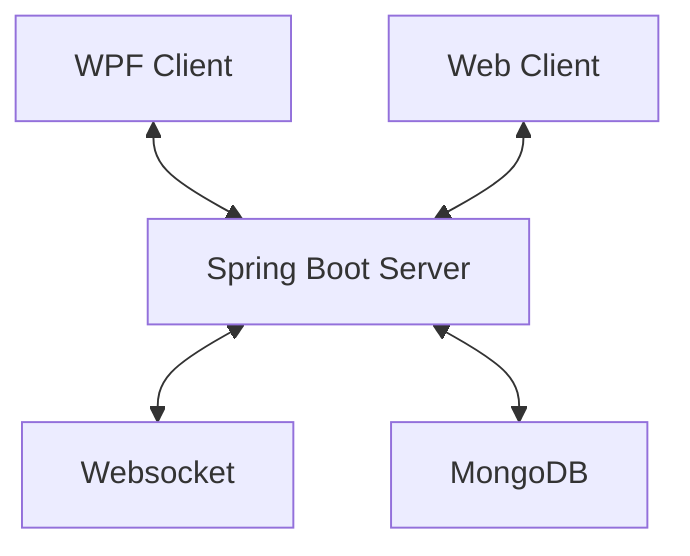
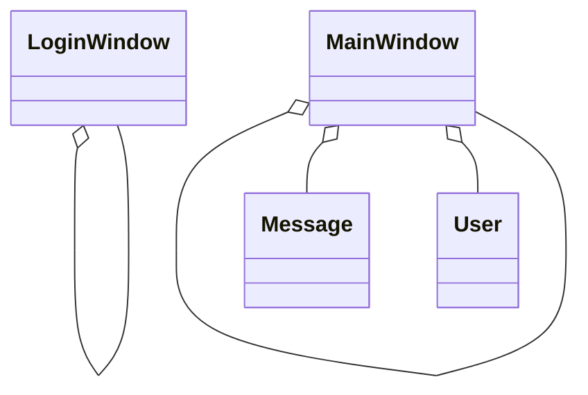
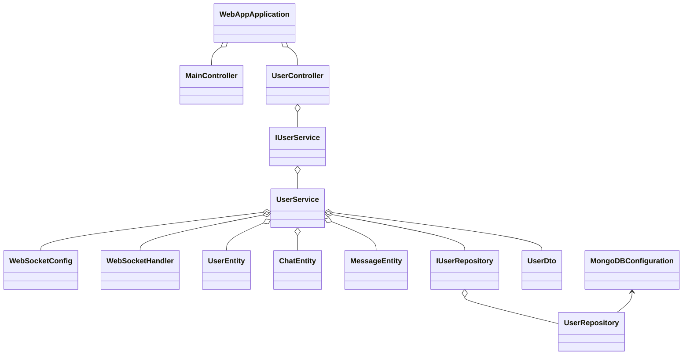

# 4AHINF - POS - Semesterprojekt - Chatapp (Tiny WhatsApp) - Krallinger


## Softwarearchitektur

Die Chatapp, Tiny Whatsapp, besteht aus einer Client-Client-Server-Architektur. Es wurde ein Client als WPF-Anwendung und ein Client als WebApp implementiert. Diese kommunizieren mit dem Spring Boot Server und werden von einem Websocket über neue Nachrichten informiert. Die Benutzerdaten und Chats werden in einer MongoDB Datenbank gespeichert.


<br>

## Beschreibung der Software

Die Chatapp bietet die Möglichkeit, dass Benutzer, über eine einfache Benutzeroberfläche, miteinander kommunizieren können. Der Benutzer kann entscheiden ob er die App im Web oder als WPF-Anwendung verwendet. Es ist möglich meherer Chats mit verschiedenen Benutzern zu haben und mit allen zu kommunizieren. Alle Chatverläufe werden in einer MongoDB-Datenbank gesichert und können immer wieder geladen werden.

<br>

## Web-App - Funktionen

### Login - Web
<br>
<br>
Im Eingabefeld **"Username"** wird der Benutzernamen eingegeben. (Testuser Benutzernamen --> **testUser** / **testUser2** / **testUser3**)<br>
Im Eingabefeld **"Passwort"** wird das Passwort des Benutzers eingegeben. (Testuser Passwörter --> **test** / **test1** / **test3**)<br>
Beim klick auf den **"Login"** Button werden die Anmeldedaten überprüft und bei erfolgreicher Überprüfung wird der Benutzer auf die Hauptseite weitergeleitet.<br>
Bei ungültigen oder unvollständigen Benutzerdaten wird der Benutzer darauf hingewiesen, dass seine Daten nicht korrekt sind und es kann ein neuer Versuch gestartet werden.<br>
<br>
<br>
<br>
<br>
<br>
Wenn der eingegeben Benutzername noch nicht vorhanden ist wird ein neuer Benutzer erstellt und danach die Hauptseite geladen.

### Mainpage - Web
<br>
<br>

#### Chats - Web
Im linken, schwarzem Feld werden alle Chats eines Benutzers angezeigt.<br>
Bei klick auf einen Chat werden rechts die Nachrichten des Chats angezeigt.<br>
Bei klick auf den **"Chat hinzufügen"** Button kann der Benutzer einen neuen Chat erstellen.<br>
Der Benutzer gibt zuerst den Benutzername des Empfängers und dann den Namen des Chats ein, sobald diese Eingabe erfolgt ist wird der Chat erstellt und im Chatfeld angezeigt.<br>
<br>
<br>
<br>
<br>


#### Nachrichten - Web
<br>
Im rechten Feld werden alle Nachrichten eines Chats angezeigt und in Echtzeit aktualisiert.<br>
Bei klick auf den Button rechts unten oder durch drücken von **"ENTER"** kann der Benutzer einen neue Nachricht senden.<br>
Der Benutzer gibt die Nachricht in das Textfeld ein, sobald die Eingabe erfolgt ist wird die Nachricht zum Empfänger gesendet.<br>
Bei beiden wird die GUI aktualisiert und die neue Nachricht wird im Nachrichtenfeld angezeigt.<br>
Bei einer neuen Nachricht wird dem Benutzer angezeigt in welchem Chat eine neue Nachricht eingegangen ist.<br> 
<br>
<br>

### WPF-App - Funktionen

### Login - WPF
<br>
<br>
Im Eingabefeld **"Benutzername"** wird der Benutzernamen eingegeben. (Testuser Benutzernamen --> **testUser** / **testUser2** / **testUser3**)<br>
Im Eingabefeld **"Passwort"** wird das Passwort des Benutzers eingegeben. (Testuser Passwörter --> **test** / **test1** / **test3**)<br>
Beim klick auf den **"Login"** Button werden die Anmeldedaten überprüft und bei erfolgreicher Überprüfung wird der Benutzer auf das Hauptfenster weitergeleitet.<br>
Bei ungültigen oder unvollständigen Benutzerdaten wird der Benutzer darauf hingewiesen, dass seine Daten nicht korrekt sind und es kann ein neuer Versuch gestartet werden.<br>
<br>
<br>
<br>
<br>
<br>
Wenn der eingegeben Benutzername noch nicht vorhanden ist wird ein neuer Benutzer erstellt.

### Hauptfenster - WPF
<br>
<br>

#### Chats - WPF
Im linken, schwarzem Feld werden alle Chats eines Benutzers angezeigt.<br>
Bei klick auf einen Chat werden rechts die Nachrichten des Chats angezeigt.<br>
Bei klick auf den **"Chat hinzufügen"** Button kann der Benutzer einen neuen Chat erstellen.<br>
Der Benutzer gibt zuerst den Benutzername des Empfängers in das Textfeld **"Empfänger"** und dann den Namen des Chats in das Textfeld **"Chatname"** ein, sobald diese Eingabe erfolgt ist wird der Chat erstellt und im Chatfeld angezeigt.<br>
<br>
<br>
<br>

#### Nachrichten - WPF
<br>
Im rechten Feld werden alle Nachrichten eines Chats angezeigt und in Echtzeit aktualisiert.<br>
Bei klick auf den Button rechts unten oder durch drücken von **"ENTER"** kann der Benutzer einen neue Nachricht senden.<br>
Der Benutzer gibt die Nachricht in das Textfeld ein, sobald die Eingabe erfolgt ist wird die Nachricht zum Empfänger gesendet.<br>
Bei beiden wird die GUI aktualisiert und die neue Nachricht wird im Nachrichtenfeld angezeigt.<br>
Bei einer neuen Nachricht wird dem Benutzer angezeigt in welchem Chat eine neue Nachricht eingegangen ist.<br> 
<br>
<br>


<br>

## API-Beschreibung
Die API wird durch einen Spring Boot Server basierend auf dem REST-Prinzip implementiert. Spring Boot ermöglicht es Clients mit dem Server, über GET und POST, zu kommunizieren und Daten auszutauschen. Weiters bietet der Server einen Websocket, bei dem sich alle Benutzer nach der Anmeldung registrieren, damit sie bei neuen Nachrichten benachrichtigt werden können und die GUI aktualisiert werden kann.<br>

### Endpunkte:<br>

<!-- Hauptendpunkt -->
<details>
  <summary>/app </summary>
  
  **Beschreibung:** Dieser Endpunkt ist der Hauptendpunkt der API, er muss vor jedem anderen Endpoint geschrieben werden.
</details>

<!-- MainController -->
<details>
  <summary>/Login [GET]</summary>
  
  **Beschreibung:** Dieser Endpunkt gibt die Html Seite **"loginPage.htmnl"** zurück.
</details>
<details>
  <summary>/mainPage [GET]</summary>
  
  **Beschreibung:** Dieser Endpunkt gibt die Html Seite **"mainPage.htmnl"** zurück.
</details>

<!-- UserController -->
<!-- Login -->
<details>
  <summary>/user [POST]</summary>
  
  **Beschreibung:** Dieser Endpunkt prüft die eingegebenen Benutzerdaten und authorisiert den Login. 
                    Es wird ein neuer Benutzer erstellt oder der vorhandene Benutzer verwendet.
  
  **JSON-Body:**
  ```json
  {
    "username": "Benutzername",
    "password": "Passwort"
  }
  ```

  **Return-Wert:**
  ```json
  {
    "id": "ID",
    "username": "Benutzername",
    "password": "Passwort",
    "chats": [
      {
        "bezeichnung": "Chatname",
        "receiver": "EmpfaengerID",
        "messageEntities": [
          {
            "message": "Nachricht",
            "receiver": "True || False",
            "date": "Zeitstempel"
          },
          { ... }
        ]
      },
      { ... }
    ]
  }
  ```
</details>

<!-- Chats -->
<details>
  <summary>/users/{userId}/chats [GET]</summary>
  
  **Beschreibung:** Dieser Endpunkt gibt eine Liste aller Chats eines Benutzers zurück.
  
  **JSON-Body:**
  ```json
  {
    "userId": "UserID"
  }
  ```

  **Return-Wert:**
  ```json
  [
    {
      "bezeichnung": "Chatname",
      "receiver": "EmpfaengerID",
      "messageEntities": [ ... ]
    },
    { ... }
  ]
  ```
</details>
<details>
  <summary>/users/{userId}/chat/{chatId} [GET]</summary>
  
  **Beschreibung:** Dieser Endpunkt gibt einen Chat des Benutzers zurück.
  
  **JSON-Body:**
  ```json
  {
    "userId": "UserID",
    "chatId": "ChatID"
  }
  ```

  **Return-Wert:**
  ```json
  {
    "bezeichnung": "Chatname",
    "receiver": "EmpfaengerID",
    "messageEntities": 
    [
      {
        "message": "Nachricht",
        "receiver": "True || False",
        "date": "Zeitstempel"
      },
      { ... }
    ]
  }
  ```
</details>

<!-- Add Chat -->
<details>
  <summary>/addChat [POST]</summary>
  
  **Beschreibung:** Dieser Endpunkt erstellt einen neuen Chat.
  
  **JSON-Body:**
  ```json
  {
    "userId": "UserID",
    "chatName": "Chatname",
    "receiver": "EmpfaengerID"
  }
  ```
</details>

<!-- Add Message -->
<details>
  <summary>/addChat [POST]</summary>
  
  **Beschreibung:** Dieser Endpunkt erstellt einen neuen Chat.
  
  **JSON-Body:**
  ```json
  {
    "id": "UserID",
    "chatname": "Chatname",
    "msg": "Nachricht",
    "receiver": "EmpfaengerID"
  }
  ```
</details>

<br>

## Verwendung der API
Abbildung der Topologie, der MongoDB-Konfiguration, des Websocket und einzelner Codeausschnitte.


<br>

## Diskussion der Ergebnisse
Durch das Semesterprojekt wurden viele bereits gelernte Fähigkeiten im Bereich der Softwareentwicklung, der Datenbankanbindung und der Webentwicklung vertieft und in einem praktischen Beispiel angewendet. Die Chatapp verknüpft alle Bereiche und zeigt wie man ein Gesamtsystem entwickelt und eine dementsprechende Dokumentation mittels MarkDown erstellt. Die App bietet eine einfache Benutzeroberfläche und die Möglichkeit Nachrichten zwischen verschiedenen Benutzern auszutauschen. Der Websocket ermöglicht eine Echtzeitaktualisierung der Chats und Nachrichten für jeden Benutzer und durch die Speicherung in einer MongoDB-Datenbank können alle Nachrichten jederzeit abgerufen werden.

<br>

### Zusammenfassung
TinyWhatsApp ermöglicht es Benutzern in Echtzeit über die REST-API und dem Websocket mit einer einfachen Bentzueroberfläche platformunabhängig zu interagieren und Nachrichten auszutauschen. MongoDB sorgt für die Speicherung aller Benutzerdaten, Chats und Nachrichten.

<br>

### Hintergründe
Bei der Chatapp stand im Vordergrund verschiedenste gelernte Tecknicken zu implementieren und miteinander zu verknüpfen, es soll im Unterricht Gelerntes angewendet werden. Die verwendeten Technologien (Spring-Boot, WPF, HTML, JavaScript, CSS, JSON und MongoDB) sichern eine zukünftige Unterstützung und sorgen für eine sichere Verwaltung und Speicherung der Daten.

<br>


## Diagramme

### Klassendiagramm WPF-Client


<br>

### Klassendiagramm Spring-Boot Server


<br>
<br>

## Quellenverzeichnis

### Spring-Boot 
#### [Spring-Boot]()
#### [JSON](https://www.json.org/json-en.html)

### WPF
#### [C#](https://learn.microsoft.com/de-de/dotnet/csharp/)
#### [JSON](https://www.json.org/json-en.html)

### Web-Client
#### [HTML](https://developer.mozilla.org/en-US/docs/Web/HTML)
#### [CSS](https://developer.mozilla.org/en-US/docs/Web/CSS)
#### [JavaScript](https://developer.mozilla.org/en-US/docs/Web/JavaScript)
#### [JSON](https://www.json.org/json-en.html)

### MongoDB
#### [MongoDB](https://www.mongodb.com/docs/)

### IDE & Nuggets
#### [WebStrom 2024.1.2](https://www.jetbrains.com/webstorm/download/download-thanks.html?platform=windows)
#### [IntelliJ IDEA 2024.1.1](https://www.jetbrains.com/idea/download/download-thanks.html?platform=windows)
   - ###### [Spring Boot Starter Data MongoDB 3.2.5](https://mvnrepository.com/artifact/org.springframework.boot/spring-boot-starter-data-mongodb/1.1.0.RELEASE)
   - ###### [Spring Boot Starter Web 3.2.5](https://mvnrepository.com/artifact/org.springframework.boot/spring-boot-starter-web)
#### [Visual Studio 2022 17.8.5](https://visualstudio.microsoft.com/de/thank-you-downloading-visual-studio/?sku=Community&channel=Release&version=VS2022&source=VSLandingPage&cid=2030&passive=false)
