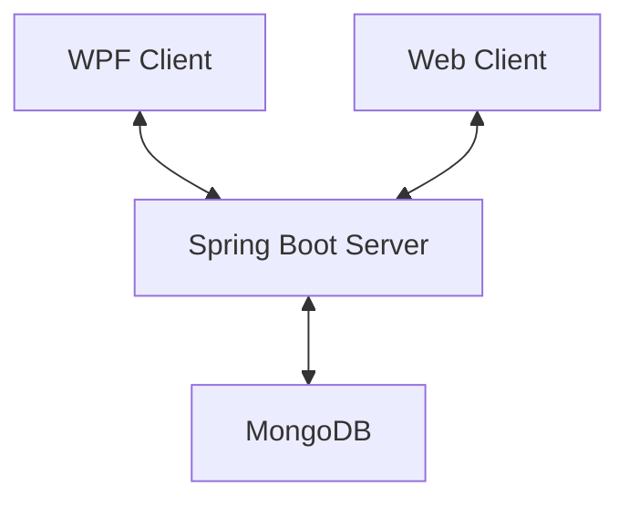

# 4AHINF - POS - Semesterprojekt - Chatapp (Tiny WhatsApp) - Krallinger

## Softwarearchitektur

Die Chatapp, Tiny Whatsapp, besteht aus einer Client-Client-Server-Architektur. Es wurde ein Client als WPF-Anwendung und ein Client als WebApp implementiert. Diese kommunizieren mit dem Spring Boot Server. Die Benutzerdaten und Chats werden in einer MongoDB Datenbank gespeichert.

 

## Beschreibung der Software

Die Chatapp bietet die Möglichkeit, dass Benutzer, über eine einfache Benutzeroberfläche, miteinander kommunizieren können. Der Benutzer kann entscheiden ob er die App im Web oder als WPF-Anwendung verwendet. Es ist möglich meherer Chats mit verschiedenen Benutzern zu haben und mit allen zu kommunizieren.

 

## Web-App - Funktionen

### Login - Web
 
 
Im Eingabefeld **"Username"** wird der Benutzernamen eingegeben. 
Im Eingabefeld **"Passwort"** wird das Passwort des Benutzers eingegeben. 
Beim klick auf den **"Login"** Button werden die Anmeldedaten überprüft und bei erfolgreicher Überprüfung wird der Benutzer auf die Hauptseite weitergeleitet. 
Bei ungültigen oder unvollständigen Benutzerdaten wird der Benutzer darauf hingewiesen, dass seine Daten nicht korrekt sind und es kann ein neuer Versuch gestartet werden. 
 
 
 
 
 
Wenn der eingegeben Benutzername noch nicht vorhanden ist wird ein neuer Benutzer erstellt.

### Mainpage - Web
 
 

#### Chats - Web
Im linken, grauen Feld werden alle Chats eines Benutzers angezeigt. 
Bei klick auf einen Chat werden rechts die Nachrichten des Chats angezeigt. 
Bei klick auf den **"New Chat"** Button kann der Benutzer einen neuen Chat erstellen. 
Der Benutzer gibt zuerst den Benutzername des Empfängers und dann den Namen des Chats ein, sobald diese Eingabe erfolgt ist wird der Chat erstellt und im Chatfeld angezeigt.

#### Nachrichten - Web
Im rechten, weißen Feld werden alle Nachrichten eines Chats angezeigt, und in Echtzeit aktualisiert. 
Bei klick auf den **"New Message"** Button kann der Benutzer einen neue Nachricht senden. 
Der Benutzer gibt die Nachricht ein, sobald die Eingabe erfolgt ist wird die Nachricht zum Empfänger gesendet. 
Bei beiden wird die GUI aktualisiert und die neue Nachricht wird im Nachrichtenfeld angezeigt.

### WPF-App - Funktionen

### Login - WPF
 
 
Im Eingabefeld **"Username"** wird der Benutzernamen eingegeben. 
Im Eingabefeld **"Passwort"** wird das Passwort des Benutzers eingegeben. 
Beim klick auf den **"Login"** Button werden die Anmeldedaten überprüft und bei erfolgreicher Überprüfung wird der Benutzer auf das Hauptfenster weitergeleitet. 
Bei ungültigen oder unvollständigen Benutzerdaten wird der Benutzer darauf hingewiesen, dass seine Daten nicht korrekt sind und es kann ein neuer Versuch gestartet werden. 
 
 
 
 
 
Wenn der eingegeben Benutzername noch nicht vorhanden ist wird ein neuer Benutzer erstellt.

### Hauptfenster - WPF
 
 

#### Chats - WPF
Im linken, grauen Feld werden alle Chats eines Benutzers angezeigt. 
Bei klick auf einen Chat werden rechts die Nachrichten des Chats angezeigt. 
Bei klick auf den **"New Chat"** Button kann der Benutzer einen neuen Chat erstellen. 
Der Benutzer gibt zuerst den Benutzername des Empfängers und dann den Namen des Chats ein, sobald diese Eingabe erfolgt ist wird der Chat erstellt und im Chatfeld angezeigt.

#### Nachrichten - WPF
Im rechten, weißen Feld werden alle Nachrichten eines Chats angezeigt, und in Echtzeit aktualisiert. 
Bei klick auf den **"New Message"** Button kann der Benutzer einen neue Nachricht senden. 
Der Benutzer gibt die Nachricht ein, sobald die Eingabe erfolgt ist wird die Nachricht zum Empfänger gesendet. 
Bei beiden wird die GUI aktualisiert und die neue Nachricht wird im Nachrichtenfeld angezeigt.

 

## API-Beschreibung
Die API wird durch einen Spring Boot Server basierend auf dem REST-Prinzip implementiert. Spring Boot ermöglicht es Clients mit dem Server, über GET und POST, zu kommunizieren und Daten auszutauschen. 

 

## Verwendung der API

 

## Diskussion der Ergebnisse

 

## Diagramme

 

## Quellenverzeichnis