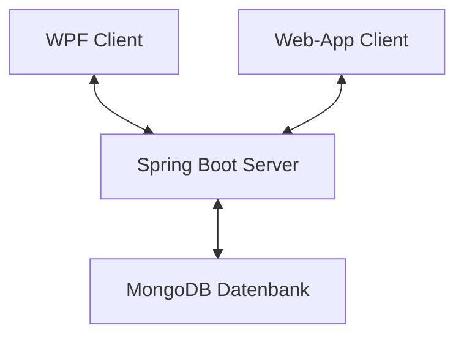

# 4AHINF - POS - Semesterprojekt - Chatapp (Tiny WhatsApp) - Krallinger

## Softwarearchitektur

Die Chatapp, Tiny Whatsapp, besteht aus einer Client-Client-Server-Architektur. Es wurde ein Client als WPF-Anwendung und ein Client als WebApp implementiert. Diese kommunizieren mit dem Spring Boot Server. Die Benutzerdaten und Chats werden in einer MongoDB Datenbank gespeichert.

## Beschreibung der Software

Die Chatapp bietet die Möglichkeit, dass Benutzer, über eine einfache Benutzeroberfläche, miteinander kommunizieren können. Der Benutzer kann entscheiden ob er die App im Web oder als WPF-Anwendung verwendet. Es ist möglich meherer Chats mit verschiedenen Benutzern zu haben und mit allen zu kommunizieren.

### WebApp

### WPF

## API-Beschreibung

## Verwendung der API

## Diskussion der Ergebnisse

## Diagramme

## Quellenverzeichnis